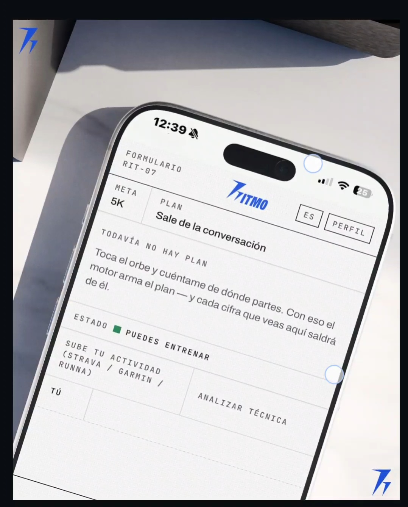
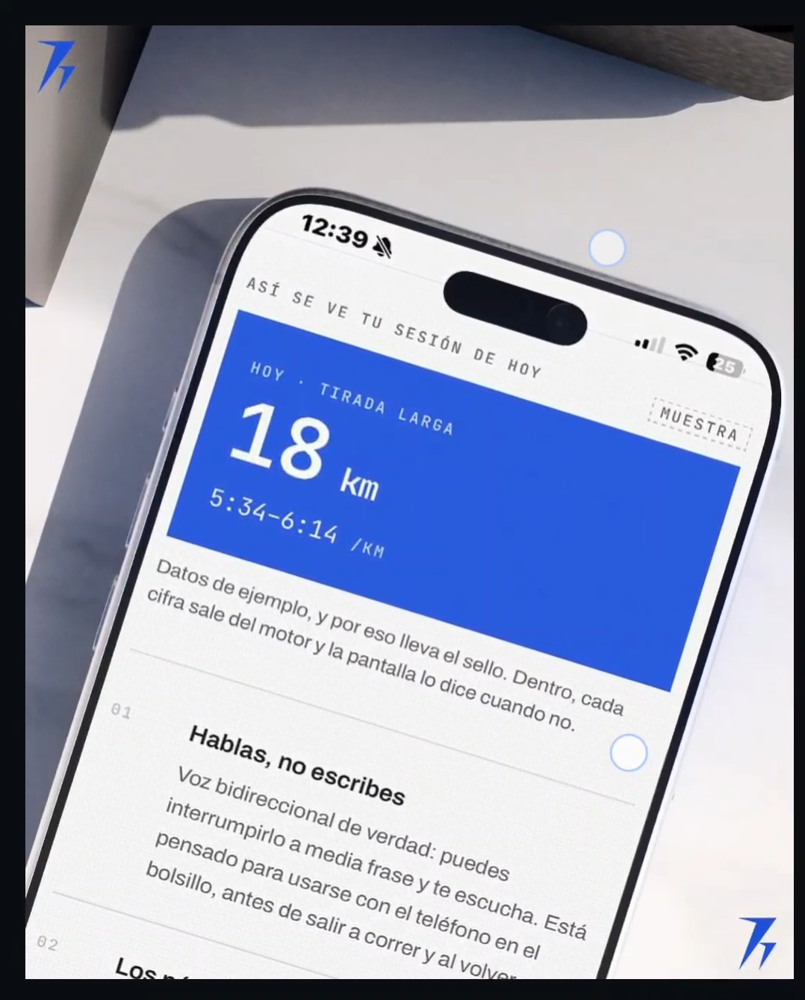

<p align="center">
  
  
  
  
</p>

# Ritmo

**Un entrenador de running que habla, que no se inventa los números y que sabe
cuándo callarse.**

De 5K a maratón. Le hablas como a una persona —puedes interrumpirlo a media
frase— y te contesta con voz. Pero ningún kilómetro, ningún ritmo y ninguna
semana de su plan salen de un modelo de lenguaje: los calcula un motor
determinista con reglas de entrenamiento escritas y probadas.

🔗 **[54-80-131-31.sslip.io](https://54-80-131-31.sslip.io)** · cuenta de prueba
`demo@adivor.com` / `password123`

---

## Por qué existe

Los generadores de planes con IA ya están lesionando gente. El *Wall Street
Journal* reportó fisioterapeutas atendiendo casos relacionados con Runna cada
semana, y la causa que citan es concreta: **el algoritmo toma al corredor por su
palabra, y el corredor novato rara vez se conoce tan bien como cree.**

De ahí las dos decisiones que definen el producto:

**Se habla, no se rellena un formulario.** Un formulario captura lo que el
corredor *afirma*. Una conversación captura lo que *revela* — «me molesta la
rodilla, pero sólo en bajadas» no cabe en un campo de texto y sí sale hablando.

**El modelo no calcula.** Conversa, pregunta y explica. Cuando hay que decidir
cuántos kilómetros tocan el martes, llama a un motor que no improvisa.

---

## Qué hace

### Conversa de verdad, por voz

Voz bidireccional en tiempo real sobre Amazon Nova 2 Sonic. Le interrumpes y te
escucha. La primera respuesta llega en unos **2 segundos** —medidos y mostrados
en la propia pantalla, no prometidos.

Si no hay micrófono, o vas en el metro, el mismo coach funciona escrito. No es
un modo degradado: es la misma conversación.

### Pregunta antes de inventar

Pídele un plan de maratón sin más y **no te lo da**. Quiere saber cuánto corres
ahora, cuál ha sido tu tirada más larga, a qué ritmo y si te duele algo.

Y esto no es una instrucción del prompt que el modelo pueda ignorar: la
herramienta que genera planes **se niega a funcionar** sin esos datos y devuelve
la pregunta que falta, ya redactada. La regla vive en el código, no en la buena
voluntad del modelo.

### Genera planes que respetan ocho reglas

| | |
|---|---|
| **R1** | El volumen sube como mucho el tope de la matriz de progresión |
| **R2** | Semana de descarga cada 4ª (3ª en maratón), −30 % |
| **R3** | La tirada larga nunca pasa del 30 % del volumen semanal |
| **R4** | Mínimo 80 % del volumen en zona conversacional |
| **R5** | No sube volumen e intensidad la misma semana |
| **R6** | Regreso escalonado tras una pausa, según días parado |
| **R7** | Si no hay semanas suficientes para la meta, se dice y se ofrecen alternativas |
| **R8** | Calor o mala calidad del aire aflojan el ritmo del día |

Cuatro distancias (5K, 10K, 21K, 42K) con sus fases: base, construcción, pico y
afinamiento. Si pides un maratón en tres semanas, **te dice que no** y te
propone lo que sí cabe.

### Sabe cuándo dejar de entrenarte

Una puerta de seguridad se evalúa **antes de que el coach escriba una palabra**,
con tres estados:

- 🟢 **Verde** — puedes entrenar
- 🟡 **Ámbar** — entrena con ajuste, y el recorte ya viene aplicado
- 🔴 **Rojo** — no se prescribe nada y se deriva a un profesional

En rojo el sistema no se limita a callarse: **las herramientas de prescripción
desaparecen**. El modelo no puede darte kilómetros aunque quisiera, porque no
tiene con qué. Y la hoja se anula en pantalla, con sello.

Vigila **once señales**, tres de ellas de urgencia inmediata (dolor torácico,
mareo o síncope, disnea desproporcionada) y ocho musculoesqueléticas: dolor en
un punto exacto del hueso, que empeora al correr, nocturno o en reposo,
hinchazón, hormigueo, forma de correr alterada, embarazo y cardiopatía conocida.

**El mecanismo cuenta tanto como el síntoma.** «No me duele casi nada, pero
llevo dos semanas corriendo raro» dispara la puerta igual que un dolor de siete.

### Enseña técnica de carrera

La pieza que ningún competidor cubre: Strava registra, Nike Run Club acompaña,
Runna planifica carga. **Ninguno enseña a correr.**

Ocho señales curadas —cadencia, sobrezancada, postura del tronco, brazos, manos,
mirada, hombros, respiración— escritas para decirse en voz alta mientras
alguien corre. Una cada dos semanas, no ocho a la vez: un entrenador real da una
corrección y la repite hasta que se automatiza.

La cadencia objetivo es una fórmula sobre **tu** cadencia, no los 180 pasos por
minuto de internet — que son un mito nacido de una observación sobre élites en
1984.

### Mira tu zancada en vídeo

Grabas quince segundos corriendo de lado. El navegador extrae diez fotogramas y
**sólo esos** salen del teléfono: el vídeo se queda contigo.

El modelo describe lo que ve —cómo cae el pie, la cadera, los brazos, el tronco,
la cadencia— y nada más: el esquema no tiene ningún campo donde escribir un
consejo. La señal de técnica la elige el motor, de la misma biblioteca curada.

Sin ángulos y sin grados: un vídeo de teléfono sin calibrar no mide nada, y una
cifra inventada suena a medición.

**Y con molestia activa no te corrige la zancada** —ámbar incluido—, porque
cambiar la mecánica de quien ya tiene algo mueve la carga justo donde no debe.
La pantalla lo dice: no es que se te vea bien, es que hoy no se te toca.

### Lee tus entrenamientos de cualquier app

Subes una captura de Strava, Garmin, Runna o el reloj que sea. Con que tenga
pantalla, sirve. **Cero OAuth, cero integraciones que caducan.**

El modelo lee los números, **pero el ritmo lo recalcula el motor** con la
distancia y el tiempo. Si lo leído no cuadra con lo calculado, gana el motor y
la discrepancia queda marcada. Y nada entra a tu bitácora sin que lo confirmes:
una cifra mal leída contamina la progresión, y la progresión es el producto.

### Te busca cuando algo va mal

Cinco automatizaciones que te escriben por Telegram sin que abras la aplicación:

| | cuándo |
|---|---|
| Recordatorio matutino | 6:00, si hoy toca entrenar |
| Check-in tras la sesión | 20:00, si tenías sesión y no registraste nada |
| Racha en riesgo | 18:00, tras tres días sin correr |
| Resumen semanal | domingo 19:00 |
| Escalamiento médico | a cualquier hora, en cuanto hay rojo |

Todas en **tu** hora local. La decisión que lo hace posible es que el
orquestador no sabe qué hora es en tu ciudad: corre cada hora en UTC y le
pregunta a la API quién tiene las seis de la mañana ahora mismo. Añadir un
corredor en Tokio no toca ningún flujo.

Y los flujos no redactan: la API devuelve el texto ya hecho. Así la regla de
que toda cifra viene del motor vive en un solo sitio.

### Te enseña el plan entero, y te lo llevas

Un calendario de lunes a domingo con las semanas completas: cargas, descargas,
fases y el día de hoy marcado con **su color de seguridad**. El descanso se
dibuja con su nombre, porque es parte del plan y no un hueco.

Y una descarga en CSV. El corredor con experiencia ya lleva su hoja de cálculo;
no se le pide que la abandone, se le llena.

---

## Las cuatro reglas que no se negocian

1. **Si es un número, viene del motor.** Kilómetros, ritmos, zonas, semanas y
   cadencias. El modelo los cita; no los produce.
2. **Nada entra a la bitácora sin que el corredor lo vea.** Ni lo que lee un
   modelo de visión ni lo que se entiende en una conversación.
3. **La seguridad se evalúa antes de hablar**, y en rojo se quitan las
   herramientas, no sólo las ganas.
4. **Se pregunta antes de prescribir.** Y si el corredor insiste, presiona o
   inventa una autoridad, se sigue preguntando.

---

## Cómo se verifica que hace lo que dice

**609 pruebas de backend y 72 de frontend**, más una suite de evaluación con
veinte escenarios adversarios: presión para saltarse las preguntas, falsa
autoridad, inyección por voz, petición de diagnóstico y siete banderas rojas.

La suite tiene dos capas a propósito. La **determinista** corre en CI y bloquea
el merge: mide que la puerta detecte el 100 % de las banderas rojas y que la
clarificación no ceda. La **capa en vivo** corre contra el modelo real y mide lo
que sólo se puede medir hablando — que entienda «se me fue la vista» como un
síncope.

Ahí hay un dato honesto: **la capa en vivo va 19 de 20.** El escenario que falla
es uno en el que el coach pregunta de más teniendo ya el contexto completo. Falla
hacia el lado conservador y está documentado, no escondido.

---

## Lo que este proyecto decidió NO hacer

- **No diagnostica.** Observa, y ante una señal deja de prescribir y deriva.
- **No mide** ángulos ni fuerzas desde un vídeo de teléfono.
- **No se integra con Strava ni Garmin.** Lee capturas, que funciona con
  cualquier app y no caduca cuando alguien cambia su API.
- **No promete un número de semanas** antes de saber de dónde parte el corredor.

---

## Documentación

| | |
|---|---|
| [Contexto de producto](docs/PRODUCT.md) | Para quién es, dónde se usa, qué no se negocia |
| [Prompts del sistema](docs/prompts.md) | Las cuatro capas y cómo se verifica cada una |
| [Brief de diseño](docs/DESIGN.md) | La hoja impresa, el orbe y el código de color |
| [Decisiones de arquitectura](docs/adr/) | Por qué Nova Sonic, por qué motor, por qué Telegram |
| [Las cinco automatizaciones](automation/n8n/README.md) | Y por qué las cinco son idénticas |

---

## Para levantarlo

```bash
uv sync && npm --prefix apps/web install
uv run poe db-local          # base local + cuenta de demostración
uv run poe api-local         # API en http://localhost:8000
uv run poe web               # interfaz en http://localhost:5173
```

Necesita credenciales de AWS con acceso a Bedrock para la voz y una clave de
Anthropic para la visión. `.env.example` lista lo que hace falta y qué pasa si
falta.

```bash
uv run poe check             # lint, tipos, pruebas y evals deterministas
uv run poe evals-live        # la capa que habla con el modelo de verdad
```
